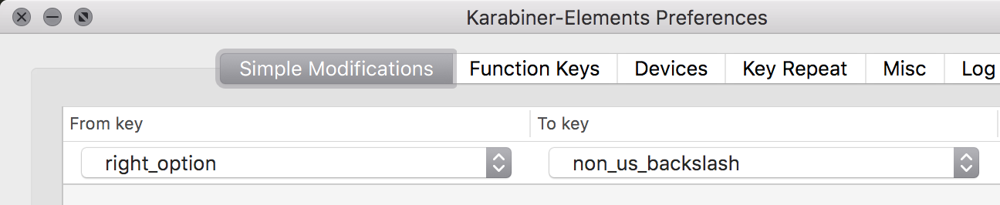

# Compose Key On Macos

`gen-compose` - generates _compose key_ keybindings for macos.  

> A compose key (sometimes called multi key) is a key on a computer keyboard that indicates that the following (usually 2 or more) keystrokes trigger the insertion of an alternate character, typically a precomposed character or a symbol.
> https://en.wikipedia.org/wiki/Compose_key

Compose keys lets you insert complex character by entering multiple characters in a succession:


e.g. `<compose_key> + d + o + w + n` will insert `👇`

Mac os doesn't come with a compose key feature built-in. However there's a short hack to make it work:

1. Keys can be rebound in mac via `~/Library/KeyBindings/DefaultKeyBinding.dict` dictionary file.
2. The rebound keys can be chained like compose keys e.g. pressing `abcd` can be made to insert `AlphaBetaCharlieDad`
3. Modifier keys cannot be rebound

With these three rules we can replicate compose key and even set it to work with a mod key!

## Install

`gen-compose` can be installed via python manager with py3.6+ versions:

```
$ pip3 install --user gen-compose
$ gen-compose --help
Usage: gen-compose [OPTIONS] [MAPPINGS]...

  Generate macos rebind file from compose json mapping

Options:
  --key TEXT  key to use as compose key  [default: §]
  -r, --raw   just keymap without prefix
  --help      Show this message and exit.
```

## Preconfig


1. First lets fix modifier key issue by forcing modifier to be a character. For example to use `right_options` key we need to use [karabiner elements] and remap it to some unused key like `non_us_backslash`:


2. Now we have the compose key ready: if we click right_options it should insert `§` character  
    However we cannot compose anything yet as we have no compose mappings yet. For that we need to modify keybindings dictionary located in `~/Library/KeyBindings/DefaultKeyBinding.dict`.  
    It's written in some cryptic hard to edit format and here's where `gen-compose` comes in and lets you write `yaml` files instead!

## Usage

1. Create yaml mappings file (e.g. `mappings/readme.yaml`):
    ```yaml
    cat: "(^≗ω≗^)"
    "+1": 👍
    "-1": 👍
    ":(": "my face is sad"
    ```
   This map defines key combinations and texts that will be inserted, e.g. `<compose_key><plus><number 1>` will insert thumbs up.  
   _note: see [mappings](./mappings) directory for some built in mappings_
2. Using `gen-compose` we generated `.dict` keybind file file from our yaml configuration:
    ```shell
    $ gen-compose mappings/readme.yaml
    {"§" = {
      "c" = {
        "a" = {
          "t" = ("insertText:", "(^≗ω≗^)");
        };
      };
      "+" = {
        "1" = ("insertText:", "👍");
      };
      "-" = {
        "1" = ("insertText:", "👍");
      };
      ":" = {
        "(" = ("insertText:", "my face is sad");
      };
    };}
    ```
   _note: multiple mappings can be used to generate a single keymap:_ `$ gen-compose map1.yaml map2.yaml`
3. Now save it directly to keybinds file:
    ```shell
    $ gen-compose mappings/readme.yaml > ~/Library/KeyBindings/DefaultKeyBinding.dict
    ```
4. Restart your programs and type `§+1` and you'll see `👍`!
5. Customize your own mapping or see `/mappings` for some existing configurations and have fun!


_note: Some programs need a hard reboot to take in the map, like `kill -9` sort of reboot to start working._

## Using XCompose Mappings

Linux's xcompose mappings are supported via experimental conversion:

```
$ gen-compose-conver xcompose --help
Usage: gen-compose-convert xcompose [OPTIONS] [FILES]...

  Convert xcompose file, that follows format like: <Multi_key> <parenleft>
  <period> <1> <parenright>: "⑴"

Options:
  -c, --keep-comments  keep inline comments
  --help               Show this message and exit.
```

For example:

```
$ cat mappings/example.compose
<Multi_key> <B> <bar> : "₿" U20BF  # BITCOIN SIGN
$ gen-compose-convert xcompose mappings/example.compose --keep-comments > example.yaml
$ cat example.yaml
"B|": "₿"  # BITCOIN SIGN
```


## Notes and Issues

* There's no way to really debug this other than trial and error and making sure applications are restarted after every update.  
* When multiple keymaps (eg `compose-gen map1.yaml map2.yal`) provided they will be joined and updated in order they are provided.
* Keymap does not allow completely overlapping keys. e.g. `egg` and `eggplant` will break because it's impossible to map two overlapping values as keymap functionality has no timeout (i.e. break if nothing is typed after a second and insert `egg`, instead it will wait indefinitely for you to finish `eggplant`)  
    If overlap happens `compose-gen` will choose the shorter form and discard the long one.  
    To fix this add end terminator character such as space: `egg<space>` rather than `egg` in your mappings.
* `DefaultKeyBinding.dict` map doesn't work in some popular programs: 
    - JetBrain editors such as PyCharm, see: https://youtrack.jetbrains.com/issue/IDEA-127470
    - QT apps such as Qutebrowser, see (and vote): https://bugreports.qt.io/browse/QTBUG-393


#### Related Resources

https://github.com/gnarf/osx-compose-key  
http://lolengine.net/blog/2012/06/17/compose-key-on-os-x  
http://bob.cakebox.net/osxcompose.php  
https://github.com/ttscoff/KeyBindings

[karabiner elements]: https://karabiner-elements.pqrs.org/
